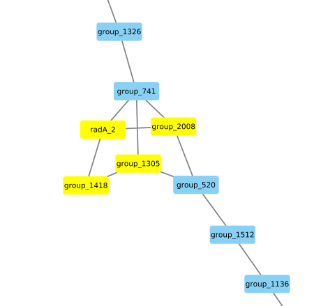
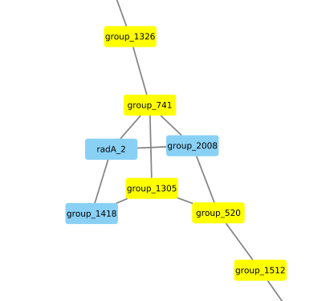
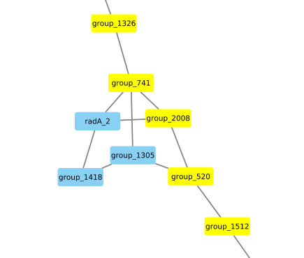
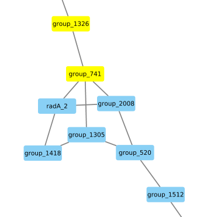

# Inspecting the genome graph neighborhood of a gene of interest
Looking at the genome graph in Cytoscape we can easily identify region in the genome graph that suggest some structural variation such as here:

We have colored nodes/genes in the graph that are supported by all samples in blue and genes that are supported by fewer samples in yellow. From this representation we cannot draw any conclusions about which paths through the genome graph are supported by which samples and/or how many different paths through that region of variation are there altogether. Here, we can use get_neighborhood.py, which will find all the paths that run through one particular node in the graph. Here we run it on gene group_741 which was found in all samples by Panaroo.
``python ~/repos/panaroo/scripts/get_neighborhood.py  group_741 final_graph.gml group_741.txt``

By default for each sample this will explore the five genes downstream and upstream from the target gene. We can add `--expand_no EXPAND NO` to change this behavior.
From the result we can see that in an overwhelming majoriy of the sample the  order of genes through the region of variation is group_741, group_1305, group_520.
Note that every other line in the result file shows a different path and the subsequent line lists all samples that agree on that path (the second line is truncated in this example). There is three more paths through that region. One paths entails group_741, group_2008, group_520 and is supported by another eight samples. group_1305 is replaced by group_2008.  
 There is also a path with group_741, radA_2, group_1418, group_1305,group_520 that is only found in 533 

  and finally a path that doesn't expand through the region of variation group_741. This suggests that there is a contig break in close vicinity of this gene in sample 858. 
